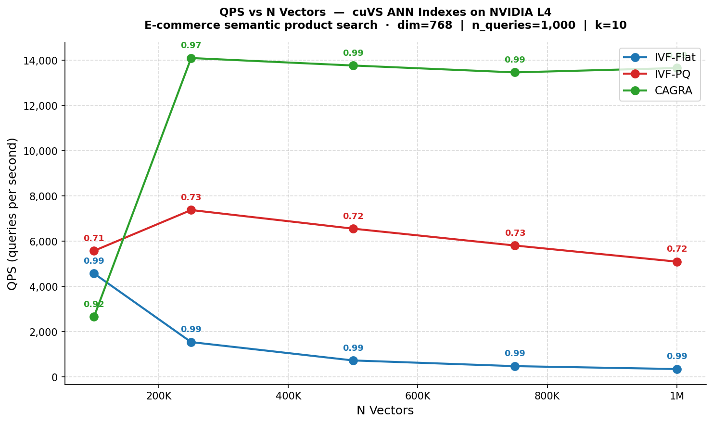
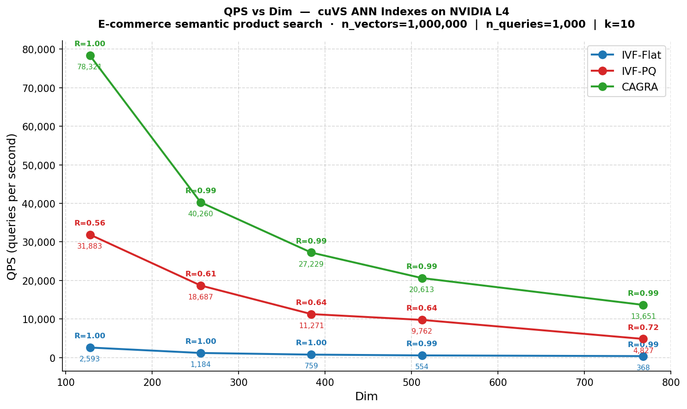
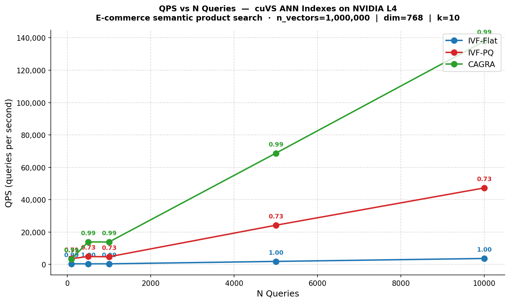
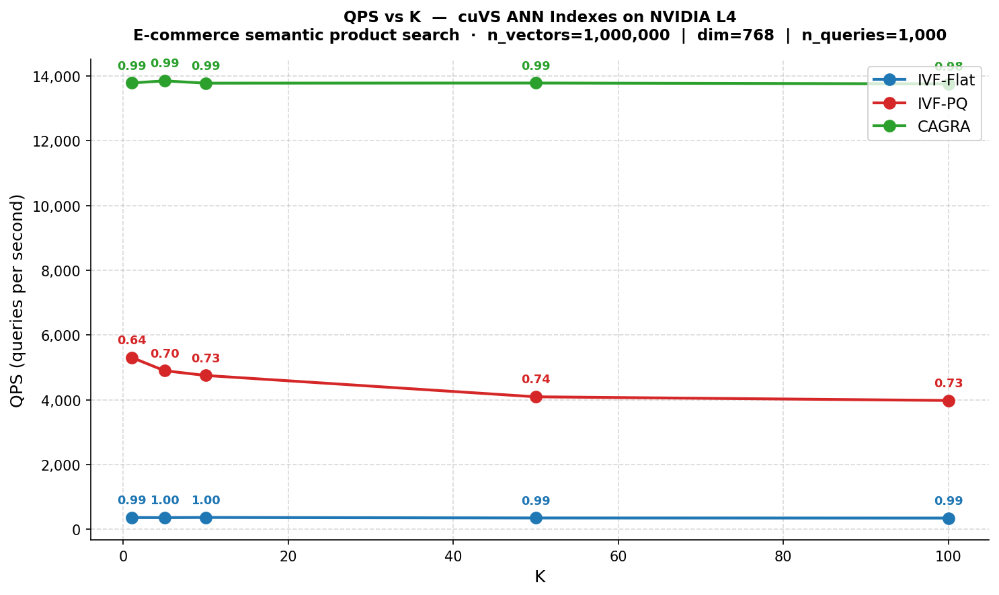
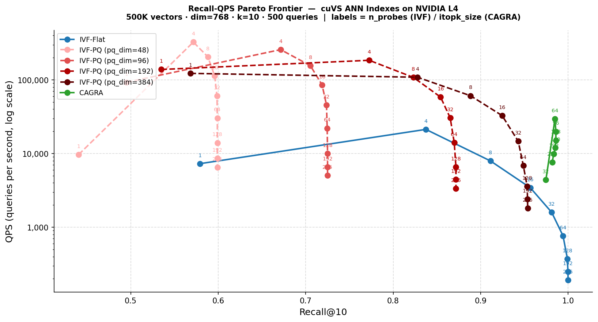

# GPU-Accelerated Vector Search: HNSW vs cuVS Benchmark

A structured benchmarking framework comparing CPU and GPU vector search algorithms
across scale, dimensionality, query load, and the speed-accuracy tradeoff.
Built on **NVIDIA cuVS** (IVF-Flat, IVF-PQ, CAGRA) and **hnswlib** (HNSW),
using real sentence-transformer embeddings on an **NVIDIA L4 GPU**.

---

## Motivation

Vector search is the backbone of modern AI applications — RAG pipelines, semantic
search, recommendation engines, and multimodal retrieval all depend on finding the
nearest neighbours of an embedding vector across a large corpus quickly and accurately.

The dominant open-source CPU solution is **hnswlib** (HNSW algorithm), widely used
in production today. NVIDIA's **cuVS** library offers GPU-accelerated alternatives
that promise higher throughput at scale. This project answers:

> **At what scale, dimensionality, and query pattern does it make sense to move from
> CPU-based HNSW to GPU-accelerated cuVS — and which cuVS algorithm should you choose?**

---

## Hardware & Environment

- **GPU:** NVIDIA L4 (24 GB VRAM, GCP VM)
- **CUDA:** 12.4
- **cuVS:** RAPIDS cuVS (conda env `cuvs-env-new`)
- **Python:** 3.10
- **Key packages:** `cuvs`, `cupy`, `rmm`, `hnswlib`, `numpy`, `matplotlib`

---

## Algorithms

| Algorithm | Type | Hardware | Key property |
|---|---|---|---|
| **HNSW** (hnswlib) | Graph-based ANN | CPU | High recall, fast single queries, slow build at scale |
| **IVF-Flat** (cuVS) | Inverted index, exact within cluster | GPU | Near-perfect recall, QPS degrades at scale |
| **IVF-PQ** (cuVS) | Inverted index + product quantization | GPU | Highest raw throughput, recall capped by compression |
| **CAGRA** (cuVS) | GPU-optimized graph ANN | GPU | Best throughput + recall simultaneously |
| **Brute-Force** (cuVS) | Exhaustive exact search | GPU | Perfect recall, O(N) — ground truth baseline only |

---

## Experiments

### benchmark.py — CPU vs GPU Across 7 Scenarios

The first benchmark compares all five algorithms on synthetic data across seven
configurations, varying corpus size, dimensionality, query batch size, k, and
distance metric. Key results:

**Run 1 (n=10k, baseline):** At small scale, GPU brute-force dominates but all
methods are competitive. HNSW build time is already 25× slower than any cuVS method.

**Run 2 (n=1M, large scale):** The core result. HNSW build time grows to ~5 minutes.
CAGRA builds in ~40 seconds and reaches ~109k QPS — roughly 8× HNSW's throughput.

**Run 4 (n_queries=1, real-time):** GPU launch overhead dominates at batch size 1.
HNSW wins here — CPU graph traversal has near-zero overhead per query. cuVS is
optimised for throughput, not single-query latency.

**Run 5 (n_queries=10k, batch):** CAGRA reaches 687k QPS — over 30× HNSW's 22k.
Any customer running batch inference or sustained high-RPS serving should be on cuVS.

**Run 3 (dim=1536, OpenAI embedding size):** IVF-PQ compresses to 73 MB (8×
reduction vs IVF-Flat's 586 MB) while still returning useful candidates for a
downstream re-ranker.

---

### benchmark_2.py — Parametric Sweep with Real Embeddings

Four experiments each vary one parameter while holding others fixed at:
`n_vectors=1M, dim=768, n_queries=1000, k=10` — a realistic e-commerce semantic
search scenario using sentence-transformer embeddings (dim=768).

**Experiment 1 — Varying corpus size (100K → 1M vectors)**



| Index | 100K vectors | 1M vectors | Trend |
|---|---|---|---|
| IVF-Flat | 4,887 QPS | 367 QPS | −92% — collapses with scale |
| IVF-PQ | 3,920 QPS | 4,892 QPS | Roughly flat |
| CAGRA | 6,312 QPS | 13,627 QPS | **+116% — improves with scale** |

CAGRA's QPS *increases* as the corpus grows because its graph traversal parallelises
better as the index fills GPU memory. IVF-Flat becomes memory-bandwidth bound at scale.
All three maintain recall ≥ 0.99 (IVF-Flat) and ≥ 0.97 (CAGRA) throughout.

**Experiment 2 — Varying dimensionality (128 → 768)**



All indexes degrade with higher dimensions (curse of dimensionality), but CAGRA
degrades the least proportionally: 77,001 QPS at dim=128 vs 13,779 QPS at dim=768
(5.6×), while IVF-Flat drops from 2,576 to 368 QPS (7×). IVF-PQ recall
*improves* with higher dim (0.55 → 0.73) because more PQ subvectors means
better distance approximation.

**Experiment 3 — Varying query batch size (100 → 10,000)**



CAGRA scales almost perfectly linearly with batch size — 140,000 QPS at 10K queries —
because each query maps to independent GPU threads. IVF-Flat barely moves (389 →
3,645 QPS). This is the most dramatic plot in the project and the strongest
argument for GPU adoption in high-traffic serving.

**Experiment 4 — Varying k (1 → 100)**



CAGRA is essentially flat from k=1 to k=100 (~14,000 QPS throughout). IVF-PQ
degrades moderately (5,268 → 4,016 QPS). IVF-Flat is largely insensitive too.
The k=50 or k=100 case is relevant for two-stage re-ranking pipelines where a
cross-encoder re-scores the retrieved candidates.

---

### benchmark_3.py — Recall-QPS Pareto Frontier

Builds each index once at fixed scale (500K vectors, dim=768, k=10, 500 queries),
then sweeps the quality knob — n_probes for IVF indexes, itopk_size for CAGRA —
to trace the full speed-accuracy tradeoff curve. IVF-PQ is run at four compression
levels to show how the quantization ceiling changes with pq_dim.



**IVF-Flat** sweeps cleanly from recall=0.58 (1 probe, 7K QPS) to recall=1.00
(256 probes, 191 QPS). More probes linearly increases recall but linearly reduces
throughput.

**CAGRA** sits in the top-right corner: 29,410 QPS at 0.985 recall with
itopk_size=64. Notably, itopk_size=32 delivers only 4,392 QPS — a 6.7× drop for
halving itopk — because CAGRA's beam search is designed around warp-level GPU
parallelism and operates suboptimally below itopk=64. Beyond itopk=64, recall
plateaus while QPS declines, so itopk=64 is the practical optimal.

**IVF-PQ quantization ceiling** — the central result of this benchmark:

| pq_dim | Compression | Recall ceiling | Peak QPS |
|---|---|---|---|
| 48 (dim÷16) | 16× | 0.60 | 325,000 |
| 96 (dim÷8) | 8× | 0.73 | 257,000 |
| 192 (dim÷4) | 4× | 0.87 | 184,000 |
| 384 (dim÷2) | 2× | 0.95 | 122,000 |

No matter how many clusters are probed, recall cannot exceed the ceiling set by
quantization error. At pq_dim=96 (the default 8× compression), recall is capped
at 0.73 even when probing all 256 clusters. At pq_dim=384 (2× compression), the
ceiling rises to 0.95 but at the cost of 2.5× higher memory usage and lower QPS.
This is a fundamental limitation of product quantization, not a tuning issue.

**The key insight:** CAGRA simultaneously achieves higher recall *and* higher QPS
than any IVF-PQ configuration at recall > 0.95. The only reason to choose IVF-PQ
over CAGRA is memory — IVF-PQ at pq_dim=96 uses ~8× less GPU memory.

---

## Algorithm Selection Guide

| Situation | Recommendation | Reason |
|---|---|---|
| Small corpus (<100K vectors) | HNSW or Brute-Force | GPU launch overhead not worth it |
| Large corpus, high throughput | **CAGRA** | Scales with corpus size, near-perfect recall |
| GPU VRAM constrained | **IVF-PQ** (pq_dim=96–192) | 4–8× memory reduction vs IVF-Flat |
| Need recall > 0.95 + high QPS | **CAGRA** | Only index that achieves both simultaneously |
| Two-stage re-ranking (large k) | **IVF-PQ** + cross-encoder | First-stage retriever doesn't need perfect recall |
| Single real-time queries | **HNSW** | GPU dispatch overhead dominates at batch=1 |
| Batch jobs / offline pipelines | **CAGRA** | Linear QPS scaling with batch size |

---

## How to Run

**Install dependencies:**
```bash
pip install hnswlib numpy matplotlib
pip install cuvs cupy-cuda12x rmm-cu12   # requires CUDA GPU
```

**Prepare real embeddings** (sentence-transformer, dim=128/256/384/512/768):
```bash
python prepare_data.py
```

**Run the original 7-scenario benchmark (CPU vs GPU):**
```bash
python benchmark.py
```

**Run the parametric sweep (4 experiments, real embeddings, ~45 min):**
```bash
python benchmark_2.py
```

**Run the Pareto frontier benchmark (~8 min):**
```bash
python benchmark_3.py
```

---

## Project Structure

```
benchmark.py        — CPU vs GPU across 7 scenarios (synthetic data)
benchmark_2.py      — Parametric sweep: n_vectors, dim, n_queries, k
benchmark_3.py      — Recall-QPS Pareto frontier with pq_dim ablation
prepare_data.py     — Downloads / encodes real sentence-transformer embeddings
hnsw.py             — Standalone hnswlib HNSW
ivf_flat.py         — Standalone cuVS IVF-Flat
ivf_pq.py           — Standalone cuVS IVF-PQ
cagra.py            — Standalone cuVS CAGRA
brute_force_knn.py  — Standalone cuVS Brute-Force
exp_n_vectors.png   — benchmark_2: QPS vs corpus size
exp_dim.png         — benchmark_2: QPS vs dimensionality
exp_n_queries.png   — benchmark_2: QPS vs query batch size
exp_k.png           — benchmark_2: QPS vs k
exp_pareto.png      — benchmark_3: Recall-QPS Pareto frontier
```
